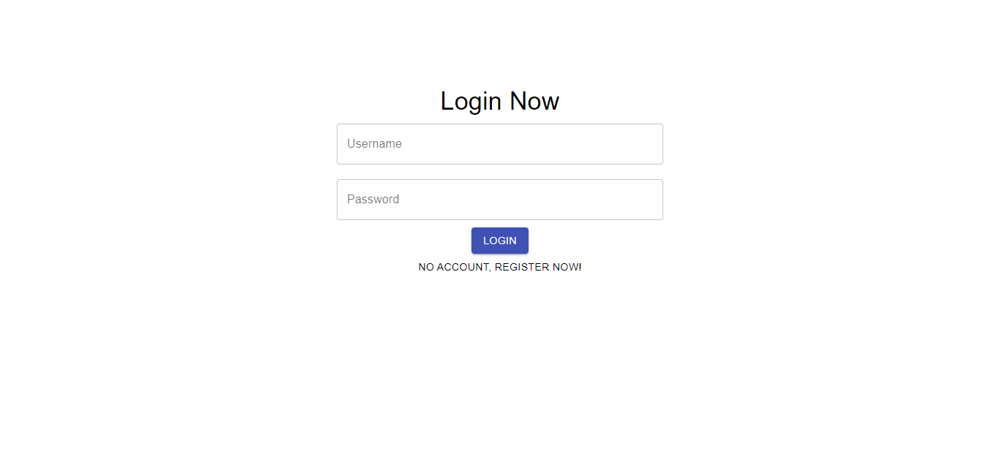
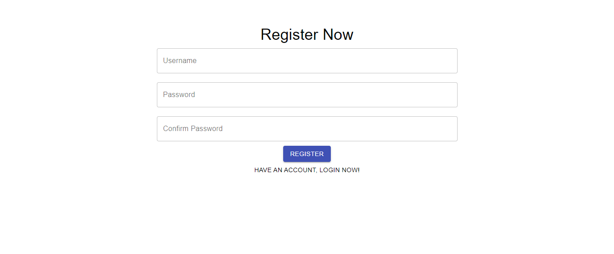
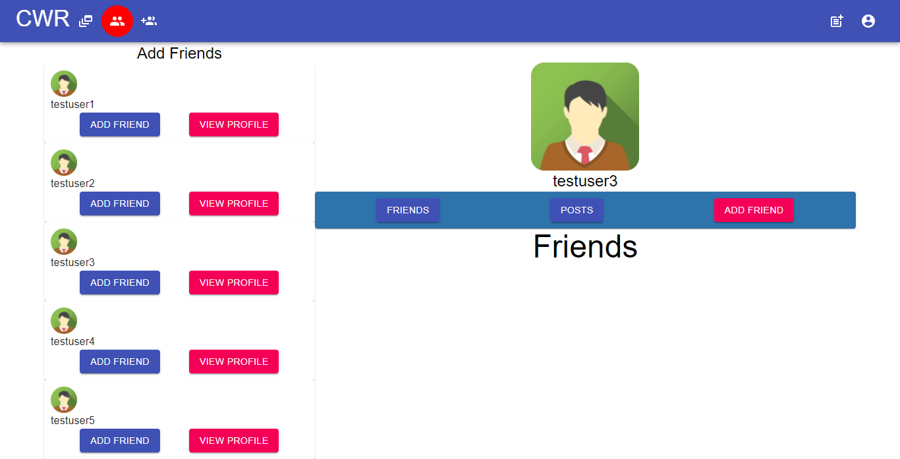
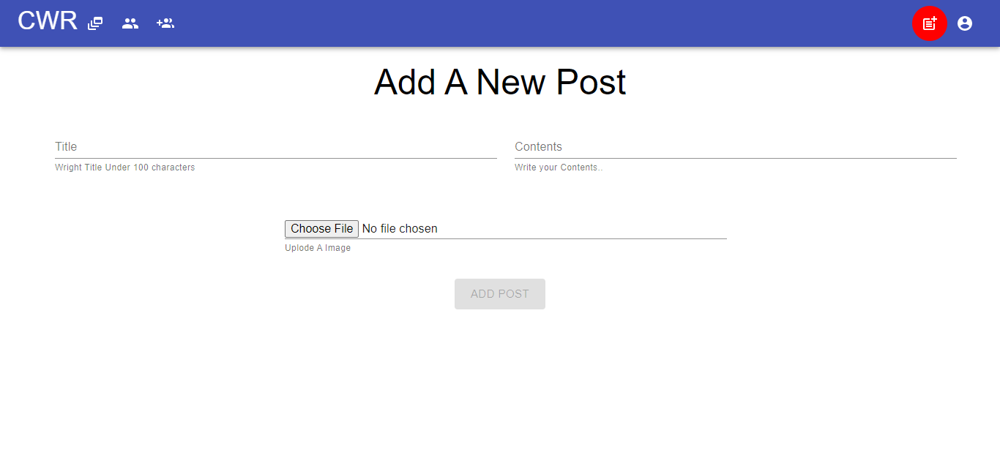
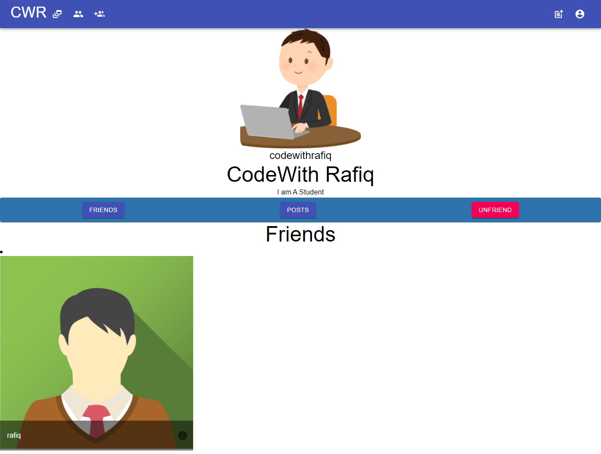
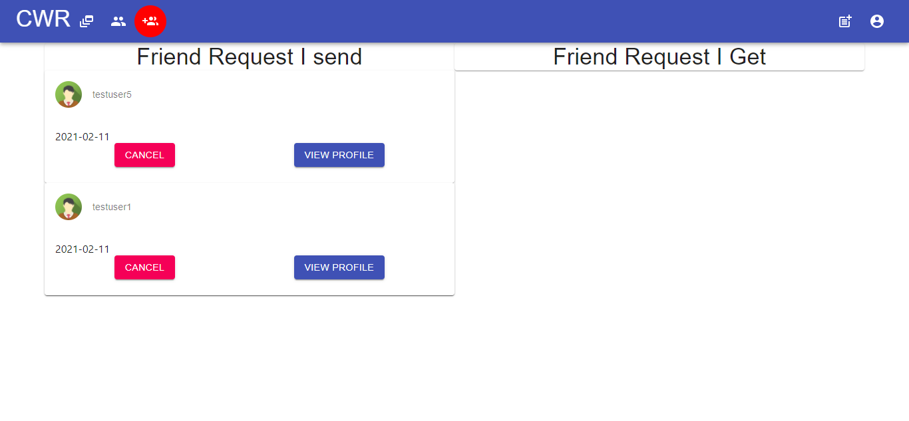

# Django Reactjs Material Ui Social Network

## [See Video](https://www.youtube.com/playlist?list=PLsC9YeVUTz39XuuWuRkydFfRBHNrhOrz0)

### Login

### Register

### Home

### Profile

### Add friends

### Add New Post

### Friend Profile

### Friend Requests

